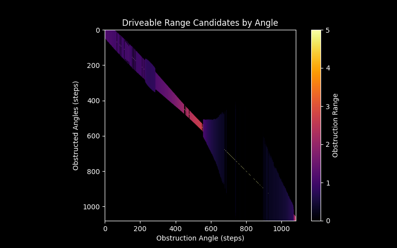

The design principle is that each point ($r, \theta$) obstructs some arc ($\theta\pm\phi$) that matches the car's width ($width_{car}$) at that range.

$\phi <= sin^{-1}(width_{car}/r)$

The effective driveable distance in any direction is the minimum range of any point which obstructs that drive angle. We use matric math to do this quickly and conveniently:

